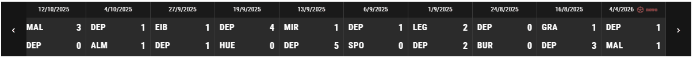

<div align="center">

<h1>
    <table border="0">
    <tr border="0">
        <td align="center" valign="middle" border="0">
        <picture>
            <source media="(prefers-color-scheme: dark)" srcset="https://cdn.simpleicons.org/wordpress/white">
            
        </picture>
        </td>
        <td valign="middle" border="0">
        <strong>Wordpress</strong><br>
        Score ticker
        </td>
    </tr>
    </table>
</h1>

**Plugin de WordPress que amosa un ticker horizontal cos resultados dos partidos (dous equipos e marcador) desprazándose de dereita a esquerda.**




</div>

## Por que

Fíxeno para un amigo que tiña unha web de deportes co tema [**Kings Club**](https://themesinfo.com/kingclub-theme-wordpress-gallery-theme-sws). Ese tema traía na parte superior un ticker cos partidos, pero quedou deprecado e sen soporte. Este plugin recupera esa funcionalidade de xeito independente do tema.

## Funcionalidades

- Ticker horizontal con desprazamento automático e bucle infinito.
- Frechas de navegación (anterior / seguinte) que avanzan tarxeta a tarxeta.
- Pausa automática ao pasar o rato por enriba.
- O partido máis recente márcase cun distintivo **novo** intermitente.
- Panel de administración propio para engadir, editar e eliminar partidos.
- Datas formatadas segundo o idioma do sitio (`determine_locale()`).
- Endpoint REST propio, listo para consumir dende outros sitios ou apps.
- Traducíbel (`.pot` incluído; tradución ao galego incluída).
- Estilo personalizábel con variables CSS, sen tocar o código do plugin.


## Configuración

### Requisitos

| | |
|---|---|
| WordPress | 5.6 ou superior |
| PHP | 7.2 ou superior |
| Base de datos | MySQL / MariaDB (a de calquera instalación estándar) |
| REST API | activa (non bloqueada por plugins de seguridade) |

### Instalación: Opción A — Subir un ZIP dende o escritorio

1. Comprime a carpeta do plugin nun ficheiro `.zip`.
2. No escritorio de WordPress: **Plugins → Engadir novo → Subir complemento**.
3. Escolle o ZIP, preme **Instalar agora** e despois **Activar**.

### Instalación: Opción B — FTP ou xestor de ficheiros do aloxamento

1. Sube a carpeta completa a `wp-content/plugins/wp-score-ticker/`.
2. No escritorio: **Plugins** e activa **Wordpress score ticker**.

Ao activar, o plugin crea automaticamente a súa táboa na base de datos e insire tres partidos de exemplo se a táboa está baleira. Se a táboa desaparecese, vólvese crear soa no seguinte `plugins_loaded`.

## Uso

### 1. Engadir partidos

Entra en **Resultados ticker** (icona no menú lateral do escritorio) e engade, edita ou elimina partidos. Cada partido ten data, dous equipos e os seus marcadores. Só os usuarios con permiso `manage_options` poden xestionalos.

> No ticker os nomes dos equipos amósanse abreviados ás **tres primeiras letras** en maiúsculas (`DEPORTIVO` → `DEP`).

### 2. Amosar o ticker na web

O shortcode é:

```
[score_ticker]
```

| Onde | Como |
|---|---|
| Editor de bloques | Bloque **Shortcode** con `[score_ticker]` |
| Widgets | Bloque de texto ou HTML co shortcode |
| Tema clásico | `<?php echo do_shortcode('[score_ticker]'); ?>` en `header.php` |
| Elementor e outros construtores | Widget **Shortcode** co mesmo texto |

En temas fillo é mellor facer os cambios no fillo para non perdelos ao actualizar o tema.

### 3. Colocalo na cabeceira, ao carón do logo

O ticker é un elemento flex (`flex: 1 1 auto`), así que abonda con envolver logo e shortcode nun contedor flexíbel:

```html
<div class="cabecera-con-ticker" style="display:flex;align-items:stretch;">
  <!-- aquí o logo ou o menú -->
  <?php echo do_shortcode('[score_ticker]'); ?>
</div>
```

### Personalización (CSS)

Todo o aspecto sae de variables CSS definidas en `assets/ticker.css`. Podes sobrescribilas no CSS do teu tema sen tocar o plugin:

```css
.score-ticker-wrap--wp {
  --ticker-bg: #2b2b2b;        /* fondo das tarxetas */
  --ticker-header: #1a1a1a;    /* franxa da data */
  --ticker-nav: #151515;       /* botóns das frechas */
  --ticker-border: #3a3a3a;    /* separador entre tarxetas */
  --ticker-text: #ffffff;      /* texto */
  --ticker-overhang: 10px;     /* canto sobresae a cinta por cada lado */
  --ticker-fold: #0a0a0a;      /* cor do dobrez das esquinas */
}
```

## Preguntas frecuentes

**O ticker aparece baleiro ou con erro.**
Comproba que haxa partidos en **Resultados ticker** e que a REST API responda en `/wp-json/score-ticker/v1/matches`. Algúns plugins de seguridade bloquéana.

**Non vexo os cambios de CSS.**
É caché do navegador ou dun plugin de caché. O CSS versiónase con `SCORE_TICKER_VERSION`: subindo esa constante fórzase a recarga.

**Podo poñer dous tickers na mesma páxina?**
Non. O JavaScript engánchase ao id `scoreTickerWp`, así que só se anima o primeiro.

**Aparecen só tres letras do nome do equipo.**
É intencionado, para que as tarxetas manteñan o mesmo ancho. Cámbiase na función `abbrev()` de `assets/ticker.js`.

## Estrutura do proxecto

```
wp-score-ticker/
├── score-ticker.php        # Cabeceira do plugin, enqueues, REST e shortcode
├── includes/
│   ├── install.php         # Creación da táboa e datos de exemplo
│   └── admin.php           # Páxina de administración (alta/edición/borrado)
├── assets/
│   ├── ticker.css          # Estilos e variables de personalización
│   ├── ticker.js           # Animación, navegación e carga de datos
│   └── img/                # Capturas e GIF de mostra
├── languages/              # .pot, .po, .mo e script de compilación
├── sql/                    # create.sql e insert.sql
└── LICENSE
```

## Historial de versións

| Versión | Cambios |
|---|---|
| 1.1.2 | Efecto cinta: a barra sobresae do contedor e engádese o dobrez nas esquinas inferiores (`--ticker-overhang`, `--ticker-fold`). |
| 1.1.0 | Distintivo **novo** no último partido, datas localizadas e pausa co rato. |
| 1.0.0 | Versión inicial: ticker, panel de administración, REST API e shortcode. |

## Licenza

GPL-2.0-or-later. Consulta o ficheiro [LICENSE](LICENSE).

## Autor

[Ismael Castiñeira](https://ipardelo.es)

```bash
VIVA GHALISIA E A COSTA DA MORTE! 💀
```
